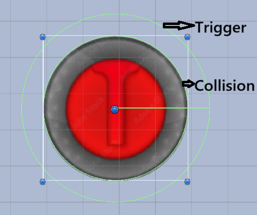
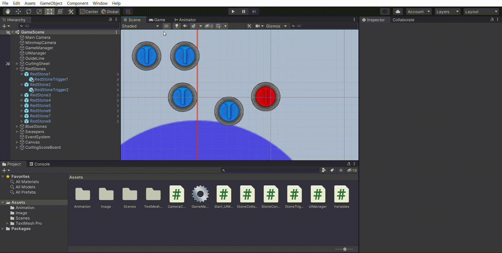
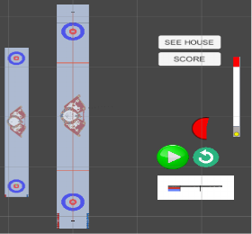
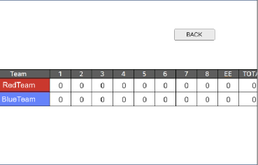
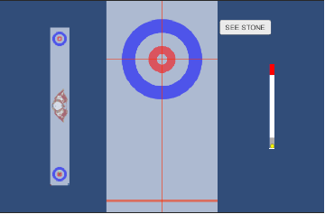
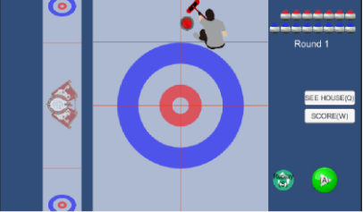
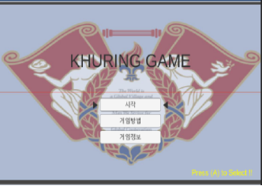
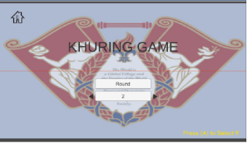
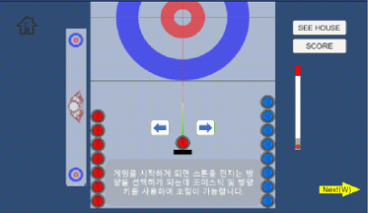
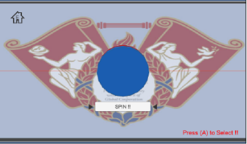

<h1> 🎮 Khuring 쿠링   <h2>🏆 2022년 대학생 논문 및 캡스톤디자인 경진대회 <최우수상></h2></h1>
<h2> [ KHU(KyungHee Univ.) + Curling ] </h2>
Unity Curling game based on physics  
직접 제작한 아두이노 게임판으로 컬링 게임을 즐길 수 있는, Khuring입니다.  
올림픽 응원을 넘어, 직접 친구와 겨뤄보세요!

## 목차

---

- [개요](#개요)
- [🔥주요 구현 사항🔥](#🔥주요-구현-사항🔥)
  - [🔥충돌 물리 구현🔥](#1-🔥충돌-물리-구현🔥)
  - [🔥리플레이 구현🔥](#2-🔥리플레이-기능-구현🔥)
- [게임 설명](#게임-설명)
- [게임 설계](#게임-설계)

 

## 개요

---

- 프로젝트 이름: Khuring 🏠
- 프로젝트 지속기간: 2022.03-2022.06
- 개발 엔진 및 언어: Unity & C#
- 팀 코춘기
  - 이용현 : 팀장, Unity Programming, Unity Asset 제작
  - 박기범 : 물리학 계산, Test 품질개선, 보고서 정리
  - 김찬우 : Arduino, 게임패드 제작

 

## 🔥주요 구현 사항🔥

---

### 1. 🔥충돌 물리 구현🔥

<b>🔑 Unity에 존재하는 두 가지 충돌감지 기능인 Collision과 Trigger를 혼용하여 구현</b> 

✅ Collision vs Trigger  
<b>공통점</b> 

- 두 오브젝트가 닿았을 때, 감지를 해주는 Unity 충돌 감지 기능을 제공
- 충돌시(Enter), 충돌도중(Stay), 충돌탈출(Exit) 3가지로 나누어 구현가능한 메서드 제공

 
<b>차이점</b>

|       구분       |                                                         Collision                                                         |                             Trigger                              |
| :--------------: | :-----------------------------------------------------------------------------------------------------------------------: | :--------------------------------------------------------------: |
|    기본 특징     |                                   충돌시 겹치지 않고 튕기도록 물리적 계산과 함께 제공됨                                   |              이동에는 영향을 주지 않고 충돌만 감지               |
|   사용된 특징    | Frame과 관계없이 Continuous한(충돌된 즉시) 충돌 감지를 제공 ➡ 빠른 속도로 충돌하더라도 정확한 충돌각을 생성하여 계산 가능 | 충돌 직후 물리계산이 적용되지 않는점 ➡ 커스텀하여 충돌 계산 가능 |
| 단독 사용시 단점 |              CollisionEnter메서드 작동시 이미 계산되어 바뀐 방향벡터를 제공받기 때문에 커스텀 충돌 구현 불가              |     Continous한 충돌을 제공하지 않기 때문에 충돌각 오차 발생     |

 

### <b>💡 아이디어 💡</b> 

<b>🔑 Collision의 Continuous한 충돌감지 기능 ➕ Trigger의 충돌 이후 방향벡터를 변화하지 않는 특징(커스텀 가능)</b> 

아래 와같이 Stone의 크기와 맞춘 Collsion 영역과 Stone보다 1.3배 큰 Trigger 영역 설정
5단계로 나누어 구현 
의도치 않은 Trigger범위와 Collision범위에서도 함수가 작동하므로 빈객체를 스톤객체의 Child로 구현 : 스크립트 분리후 태그로 확인

1. OnTriggerEnter
   근처도달 - 주변 스톤에서 감지 - 속도 리스트추가

2. OnCollisionEnter
   Continuous로 충돌감지
   먼저 동작하는 Script에서 접선 기준 새로운 기저 단위벡터 계산
   각자의 Velocity를 새로운 기저벡터로 표현
   충돌후 움직여야할 Velocity벡터 계산
   RigidBody2D의 position(transform.position 이랑 다름)을 약간 변화함(백스텝)으로서 CollisionExit함수 강제호출(기본 물리엔진에 의한 충돌 후 붙어있는 경우 고려)

3. OnCollisionExit
   계산된 충돌후 Velocity벡터 적용
   연쇄충돌을 고려하여 변한 Velocity를 주변 스톤들의 가지고 있던 다른 Stone의 werVector갱신을 위한 파라미터 초기화

4. 다른 스톤과의 충돌로 인해 PowerVector가 변하였다면 가까운 모든 스톤에서의 해당스톤 werVector의 Velocity 정보 갱신

5. OnTriggerExit
   멀어졌으므로 NearStone리스트에서 삭제
    

### 충돌 시연 영상

  

### 2. 🔥리플레이 기능 구현🔥

- 스톤이 작동되는데 필요한 (위치, 파워, 방향, 스핀, 스위핑 등의)정보를 저장해 두었다가, 그대로 다시 작동하도록 구현
- Update 메서드가 일정한 주기로 작동되지 않아 <b>Unity에 존재하는 이벤트 기능중 Update와 FixedUpdate 메서드를 혼용하여 구현</b> 

✅ Update vs FixedUpdate  
<b>공통점</b> 

- Unity에서 제공하는 이벤트 메서드로, 특정 시점에 자동으로 반복하여 시행되는 메서드

 
<b>차이점</b>

|       구분       |                              Update                               |                     FixedUpdate                      |
| :--------------: | :---------------------------------------------------------------: | :--------------------------------------------------: |
|    기본 특징     |                  매 프레임 마다 작동되는 메서드                   |   프레임과 관계 없이 특정 주기마다 작동되는 메서드   |
|   사용된 특징    |              파워, 스핀, 스위핑 등의 입력을 잘 받음               | 입력받은 시간을 저장하고, 그대로 실행할 수 있도록 함 |
| 단독 사용시 단점 | 불규칙한 시간에 작동되어 리플레이시 면밀하게 똑같이 작동하지 않음 | 게임패드(키보드)의 입력이 무시되는 경우가 다수 존재  |

 

### <b>💡 아이디어 💡</b> 

- Update에서 입력을 받은 후 flag를 전달 ➕ flag를 바로 다음 FixedUpdate 메서드에서 받고, 입력정보를 control할 수 있는 명확한 시간에 저장 
  - 예) 0.02초의 FixedUpdate 주기 : 0.016, 0.023, 0.067초에 3번 입력이 들어왔으면 각각 0.02, 0.04, 0.08초에 작동되는 FixedUpdate에서 저장, 리플레이시 0.02, 0.04, 0.08초에 동일하게 작동하도록 구현
- 스톤 작동 구현 메서드별로 Replay모드 Boolean 변수 사용, 분기하여 처리

 

## 게임 설명

---

|  |  |
| :------------------------------------------------------------: | :------------------------------------------------------------------------: |
|                           시작 화면                            |                                 게임 화면                                  |

평창 동계올림픽에서 응원하던 "팀킴(Team Kim)", 비용과 접근성으로 체험하기 힘든 컬링게임을 자체 제작 게임판으로 직접 체험해 보세요!  

- 자체 개발 충돌엔진으로 실제와 같은 스톤의 움직임을 체험하라 !  
  실제 얼음판 위의 스톤의 충돌과 유사한 움직임을 느낄 수 있도록 구현하였습니다.
- 조이스틱으로 스위핑 하는 기분을 느껴라 ! 
  컬링의 꽃인 빗자루질을 최대한 느낄 수 있도록 조이스틱을 사용하여 스톤의 진행거리를 조절해 보세요.
- 실제와 같은 진행방식을 익혀라 ! 
  컬링을 던지는 드로우(throw)부터, 회전, 빗자루질(sweeping), 점수 계산법까지 직접 하면서 컬링 규칙을 익혀보세요.
- 친구와 함께 경기하라 ! 
  Khuring은 2인용 게임입니다. 빨간색, 파란색팀으로 나누어 친구와 높은 점수를 얻도록 플레이해보세요.
- 초보자도 누구나! 👶 
  튜토리얼 기능, 리플레이 기능으로 편리하게 게임할 수 있습니다.

  

## 게임 설계

---

 

### 1. Unity를 사용하여 2D 이미지 구현 및 게임 개발

- 스톤의 방향 구현 
  조이스틱을 사용하여 방향 각도를 조절 후 버튼으로 결정
- 스톤의 세기 구현 
  최소와 최대 사이를 반복하여 사용자가 원하는 순간에 버튼으로 결정
  스톤이 호그라인 근처까지 움직일 수 있는 최소 세기를 회색으로 표현하고 세기가 90%가 넘어가면 PowerShot으로 설정하여 빨간색으로 표현
- 스톤의 회전 구현 
  최소와 최대를 설정한 후 빨간 원이 생기며 시계방향 또는 반시계방향으로 원이 채워지게 되는데 시계방향으로 채워지면 오른쪽, 반시계방향을 채워지면 왼쪽으로 회전을 하게 되며 사용자가 원하는 순간에 버튼을 누르면 회전하도록 구현
- 스톤의 스위핑 구현 
  조이스틱을 왼쪽 또는 오른쪽으로 움직이면 스위핑을 1회 실시한 것으로 설정하여 사람 형태의 이미지가 브룸을 움직임
- 스톤의 충돌 구현 
  스톤들끼리의 연쇄충돌 구현(마찰, 분리각, 회전 적용)

 

### 2. 게임요소 구현

|                    점수판                    |                    시점 변환                     |                        리플레이                         |
| :------------------------------------------: | :----------------------------------------------: | :-----------------------------------------------------: |
|  |  |         |
|           점수 계산 및 점수판 구현           |     경기 중 하우스 버튼 및 하우스 시점 구현      | 리플레이 버튼 실행 시 바로 이전 스톤의 진행 영상을 실행 |

 

### 3. 이미지 제작

|               게임 시작 및 끝 화면               |          게임 라운드 선택 및 선공 화면           |              게임 방법 및 정보 화면              |
| :----------------------------------------------: | :----------------------------------------------: | :----------------------------------------------: |
|  |  |  |
|      |  |
